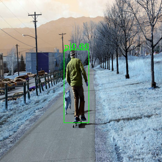

# Visualize caffe model prediction
**Creator: Su Huynh - Date Aug 19 2020**

--------------------------------
## I. Introduction
After convert model from Pytorch --> 0nnx --> Caffe, we need to visualize the caffe model prediction whether is correct or not

--------------------------------

## II.Usage
- In current dir, open the terminal and run the command:

```
python test_output_caffe.py <argument1> <argument2> ... <argumentn>
```
- Argument parser:
```
parser.add_argument('caffe_checkpoint', help='caffe checkpoint file')

parser.add_argument('img_path', type=str, help='Images for input')

parser.add_argument('--show_dir', default='./result_caffe',help='directory where testing images will be saved')

parser.add_argument('--shape', type=int, nargs='+', default=[320, 320], help='input image size')

```
- Example results:


